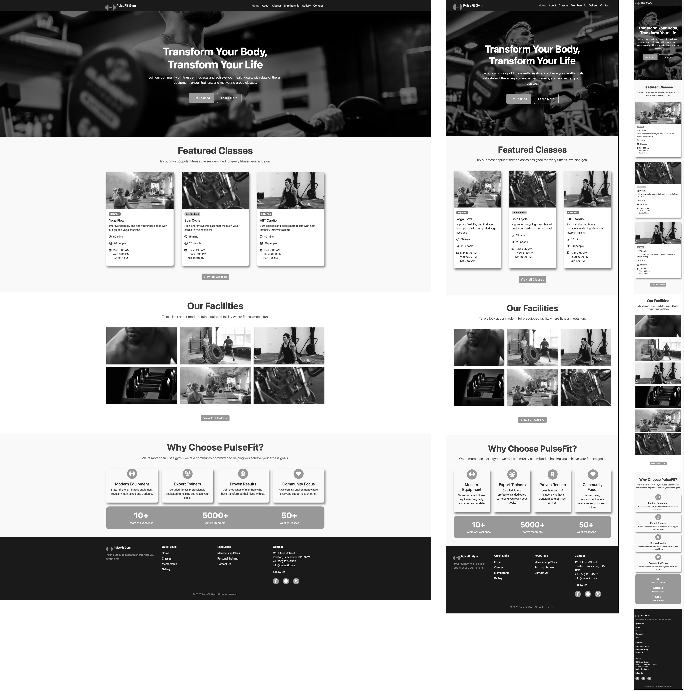
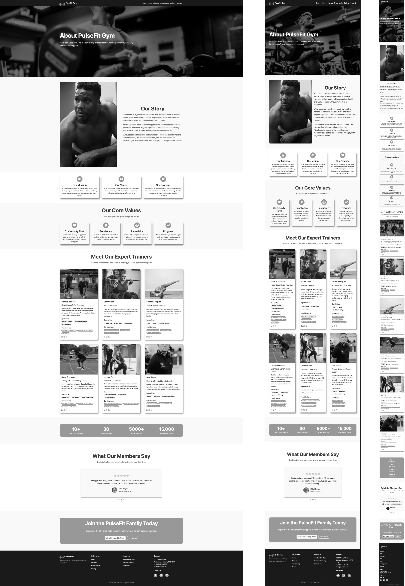
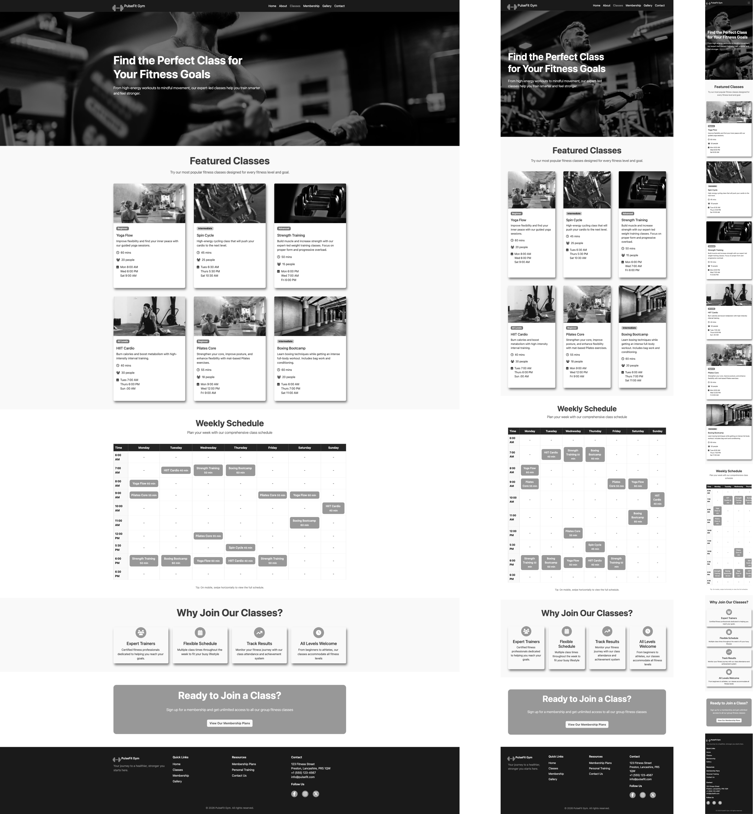
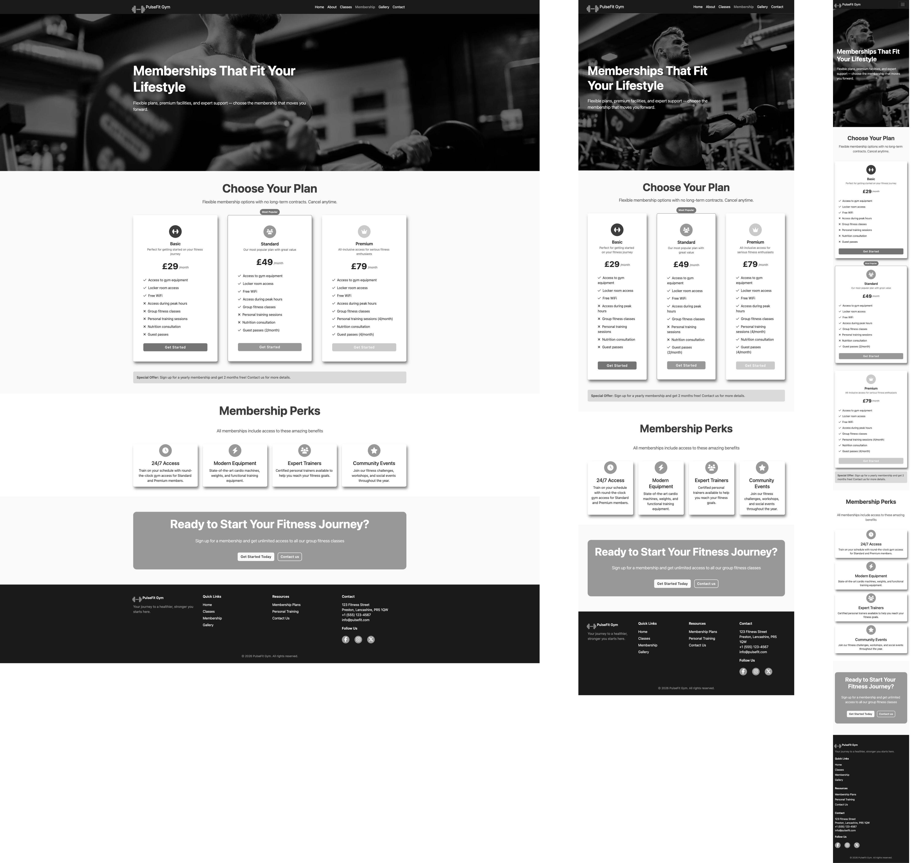
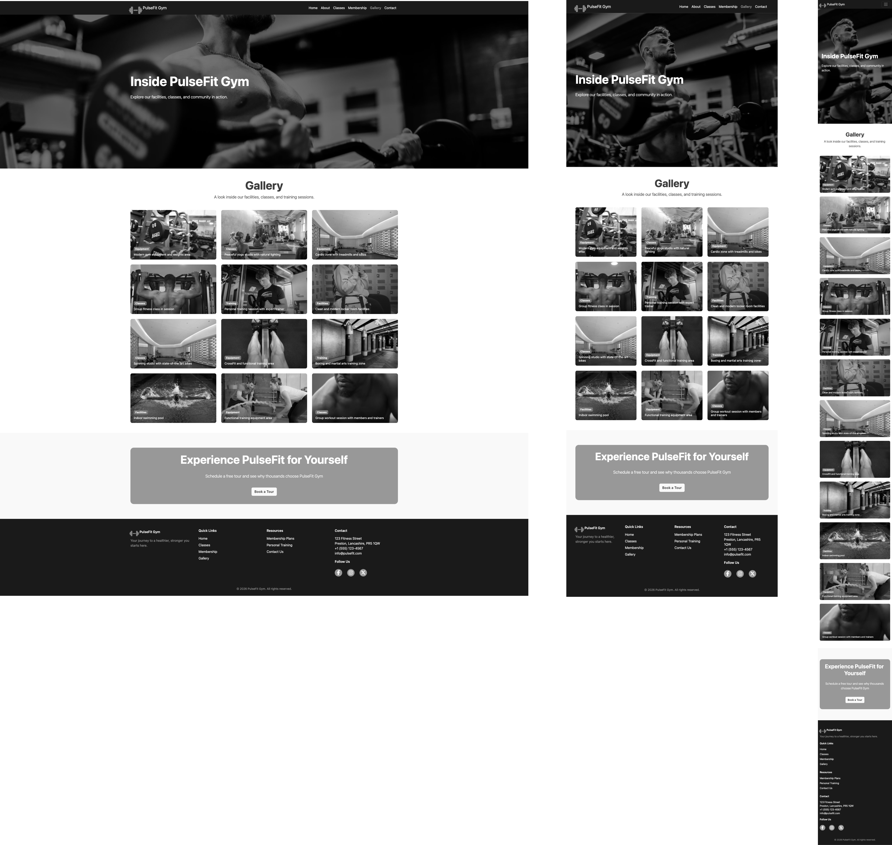
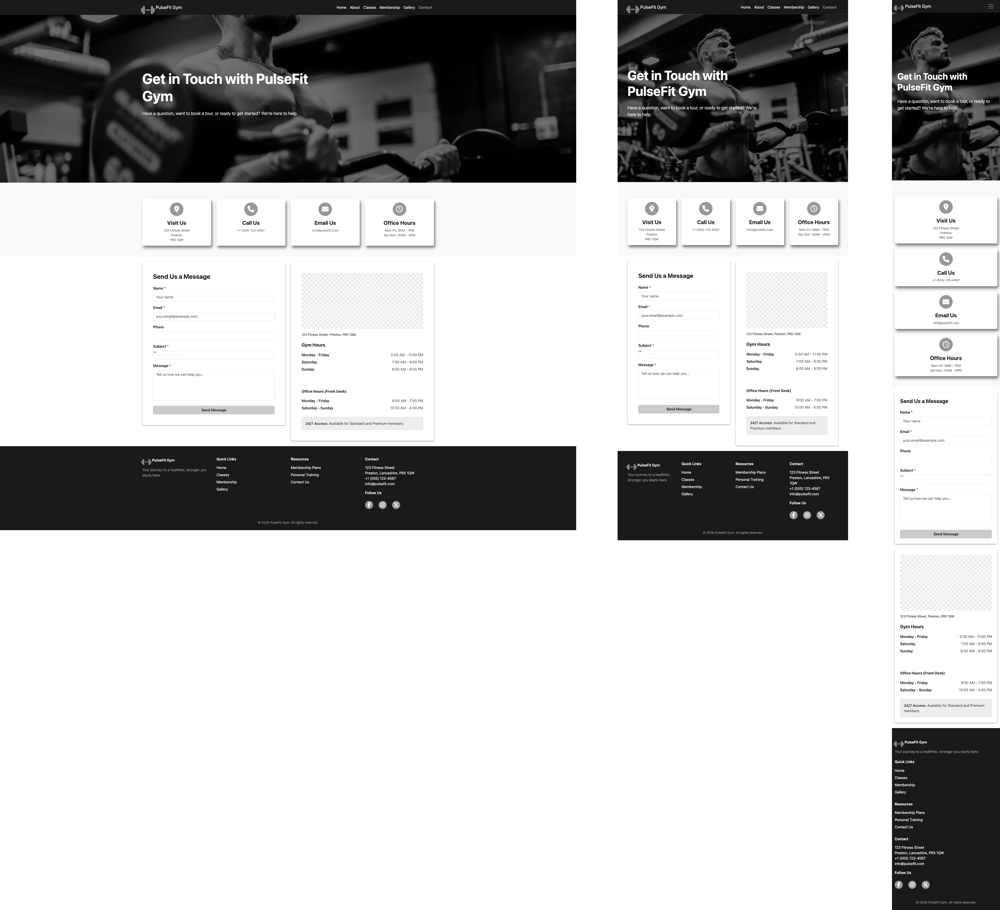

# PulseFit Gym

PulseFit Gym is a responsive, multi-page website designed to promote a modern fitness gym and help potential members easily explore services, compare membership options, and get in touch.

The purpose of this application is to provide users with clear, accessible information about the gym’s facilities, classes, and pricing, while guiding them towards taking action such as booking a tour or making an enquiry.

## Value to Users

This website provides value by:

- Allowing users to quickly understand what the gym offers without confusion
- Helping users compare membership plans to find one that suits their needs and budget
- Making it easy to explore available classes and facilities
- Providing clear calls-to-action that guide users towards contacting the gym or booking a visit
- Offering a responsive design so users can access the site on mobile, tablet, or desktop

By focusing on clarity, structure, and ease of navigation, the site improves the overall user experience and helps users make informed decisions about joining the gym.

---

## Live Site

- (https://fahim2023.github.io/pulseFitGym/)

---

## User Experience (UX)

### UX Strategy – The 5 Planes of UX

#### 1. Strategy Plane

The primary goal of this project is to attract potential gym members by clearly communicating the gym’s offerings and encouraging enquiries or tour bookings.

**Business Goals**

- Promote PulseFit Gym and its facilities
- Increase membership enquiries
- Encourage users to book a tour
- Clearly present pricing and class information

**User Goals**

- Learn what the gym offers
- View available classes and facilities
- Compare membership options
- Easily contact the gym or book a tour

---

#### 2. Scope Plane

Based on the goals above, the following features were included:

- Multi-page website (Home, About, Classes, Membership, Gallery, Contact)
- Responsive navigation bar
- Hero section with clear call-to-action
- Class cards with difficulty, duration, and schedule
- Membership pricing cards with feature comparison
- Image gallery with category labels
- Contact form and “Book a Tour” modal
- Consistent CTA sections across pages

---

#### 3. Structure Plane

The information architecture was designed to be simple and intuitive:

- **Home** – Overview of gym benefits, featured classes, and facilities
- **About** – Gym story, mission, values, and trainers
- **Classes** – Detailed class offerings
- **Membership** – Pricing plans and feature comparison
- **Gallery** – Visual showcase of the gym
- **Contact** – Contact details and enquiry form

Navigation is consistent across all pages and follows common user expectations.

---

#### 4. Skeleton Plane (Wireframes)

Wireframes were created before development to plan layout and content hierarchy for:

- Desktop
- Tablet
- Mobile

### Home Page

The home page features a full-width hero section with a clear call-to-action, followed by featured classes and facilities sections to immediately communicate the gym's value to new visitors.

### About Page

The about page is structured to tell the gym's story, followed by core values and a trainer showcase to build trust with prospective members.

### Classes Page

Classes are displayed as cards showing difficulty level, duration and schedule, making it easy for users to find a class that suits them. A weekly timetable is included below.

### Membership Page

Three pricing tiers are displayed side by side with a highlighted popular plan to guide users towards the most common choice.

### Gallery Page

A responsive image grid showcases the gym's facilities and classes with category labels to help users identify what they are looking at, at the bottom there is a CTA button that triggers a modal popup form where users can book a tour.

### Contact Page

The contact page combines key contact details, a map, opening hours and an enquiry form in a single view to make it as easy as possible for users to get in touch.

### Book a Tour Modal

The "Book a Tour" modal is triggered from the Gallery page, allowing users who have just viewed the gym's facilities to immediately take action and book a visit. This placement was intentional to capitalise on user interest after browsing the gallery.

Key design decisions included:

- Prominent hero section with CTA
- Card-based layouts for classes and memberships
- Image-heavy gallery with readable overlays
- Forms placed prominently and clearly labelled

---

#### 5. Surface Plane (Visual Design)

- Colour palette based on strong, energetic brand colours
- Consistent typography using Bootstrap defaults with custom styling
- Clear visual hierarchy using headings, spacing, and cards
- High-quality imagery to reinforce a premium gym experience
- Subtle hover effects to improve interactivity

---

## Style Guide

### Colour Palette

The PulseFit Gym website uses a consistent colour scheme to create a strong and energetic brand identity:

- Primary Colour: #ff6b35 (used for buttons, highlights, and CTAs)
- Primary Dark: #e5511d (hover states)
- Secondary Colour: #2c3e50 (text and headings)
- Light Background: #f8f9fa (section backgrounds)
- Dark Background: #1a1a1a (navbar and footer)

These colours are defined using CSS variables in the root selector to ensure consistency across the site.

---

### Typography

- Font: Default Bootstrap font stack (system fonts)
- Headings: Bold, large display sizes for clear hierarchy
- Body Text: Clean and readable with sufficient spacing
- Buttons: Uppercase styling with increased letter spacing

---

### Layout & Structure

- Built using Bootstrap 5 grid system
- Mobile-first responsive design
- Consistent use of:
  - Containers for layout alignment
  - Rows and columns for structure
  - Cards for reusable UI components

---

### Components

Reusable components are used across the site for consistency:

- Navigation bar (fixed-top)
- Cards (classes, membership, trainers)
- CTA sections
- Footer

---

### Imagery

- Images are used to enhance engagement and showcase facilities
- All images are optimised in `.webp` format
- Lazy loading is applied where appropriate

---

### UI Consistency

- Consistent spacing using Bootstrap utilities
- Uniform button styles across all pages
- Repeated layout patterns for familiarity
- Clear visual hierarchy using headings and spacing

---

## User Stories

### New Users

- As a First-Time Visitor I need easy navigation and a user-friendly design, including a responsive layout for my device So that I can find information quickly and efficiently without frustration.
- As a Prospective Member I need clear information about the gym’s services, classes, and trainers So that I can decide whether this gym meets my fitness needs.
- As a new user, I want to view membership prices clearly.

### Returning Users

- As a Returning Visitor I need quick access to important pages such as classes and contact information
  So that I can efficiently plan my visits or get in touch with the gym.

### Business Owner

- As a business owner, I want users to enquire about memberships.
- As a business owner, I want to encourage tour bookings.
- As a business owner, I want the website to look professional and trustworthy.

---

## Features

- Responsive design using Bootstrap 5
- Semantic HTML for accessibility
- Reusable components (navbar, footer, CTA sections)
- Image gallery with overlay captions
- Membership cards with highlighted popular plan
- Contact form and modal tour booking form
- Lazy-loaded images for performance
- Modern `.webp` image format

---

## Technologies Used

- HTML5
- CSS3
- Bootstrap 5
- Font Awesome
- Google Chrome DevTools
- GitHub

---

## Testing

### Manual Testing

Manual testing was carried out to ensure the website functions correctly, is easy to use, and is responsive across different devices.

#### Functionality Testing

| Feature                          | Expected Outcome                      | Result | Screenshot                                                               |
| -------------------------------- | ------------------------------------- | ------ | ------------------------------------------------------------------------ |
| Navigation - Home                | Navigates to Home page                | Pass   |                            |
| Navigation - About               | Navigates to About page               | Pass   |                           |
| Navigation - Classes             | Navigates to Classes page             | Pass   |                         |
| Navigation - Membership          | Navigates to Membership page          | Pass   |                      |
| Navigation - Gallery             | Navigates to Gallery page             | Pass   |                         |
| Navigation - Contact             | Navigates to Contact page             | Pass   |                         |
| CTA - View Membership            | Directs user to membership page       | Pass   |  |
| CTA - Get Started                | Directs user to choose a plan         | Pass   |         |
| CTA - Learn More                 | Directs user to About page            | Pass   |                 |
| CTA - Contact Us                 | Directs user to contact form          | Pass   |                  |
| Contact form                     | Form requires input before submission | Pass   |                      |
| Modal (Book a Tour)              | Modal opens and closes correctly      | Pass   |        |
| Responsive - Mobile (Home)       | Layout stacks correctly on mobile     | Pass   |                        |
| Responsive - Mobile (About)      | Layout stacks correctly on mobile     | Pass   |                      |
| Responsive - Mobile (Classes)    | Layout stacks correctly on mobile     | Pass   |                  |
| Responsive - Mobile (Membership) | Layout stacks correctly on mobile     | Pass   |            |
| Responsive - Mobile (Gallery)    | Layout stacks correctly on mobile     | Pass   |                  |
| Responsive - Mobile (Contact)    | Layout stacks correctly on mobile     | Pass   |                  |
| Responsive - Tablet (Home)       | Grid adjusts correctly on tablet      | Pass   |                        |
| Responsive - Tablet (About)      | Grid adjusts correctly on tablet      | Pass   |                      |
| Responsive - Tablet (Classes)    | Grid adjusts correctly on tablet      | Pass   |                  |
| Responsive - Tablet (Membership) | Grid adjusts correctly on tablet      | Pass   |            |
| Responsive - Tablet (Gallery)    | Grid adjusts correctly on tablet      | Pass   |                  |
| Responsive - Tablet (Contact)    | Grid adjusts correctly on tablet      | Pass   |                  |

---

#### Usability Testing

- Navigation is clear and consistent across all pages
- Content is easy to read with proper spacing and hierarchy
- Users can quickly find key information such as classes and membership
- Call-to-actions are clearly visible and guide user behaviour

---

#### Responsiveness Testing

The site was tested on multiple screen sizes using Chrome DevTools:
| Device | Result |
|------|--------|
| Mobile | Layout stacks correctly, content readable |
| Tablet | Grid adjusts appropriately |
| Desktop | Full layout displayed correctly |

---

#### Browser Testing

| Browser       | Result                        |
| ------------- | ----------------------------- |
| Google Chrome | All features work as expected |
| Firefox       | All features work as expected |

### Validation

#### HTML

All HTML pages were tested using the W3C Nu HTML Checker and passed with no errors.

- Home: 
- About: 
- Classes: 
- Membership: 
- Gallery: 
- Contact: 

#### CSS

The CSS stylesheet was tested using the W3C CSS Validator and passed with no errors.

### User Story Testing

| User Story                                                                               | How it is met                                                                      | Screenshot                                                |
| ---------------------------------------------------------------------------------------- | ---------------------------------------------------------------------------------- | --------------------------------------------------------- |
| User Story 1 – First-Time Visitor: I need easy navigation and a responsive layout        | Responsive navbar present on all pages with clear links to all sections            |           |
| User Story 2 – Prospective Member: I need clear information about classes and trainers   | Classes page displays class cards with details, About page lists trainers          |          |
| User Story 3 – Mobile User: I need the website to display correctly on my phone          | Bootstrap mobile-first grid ensures all pages adapt to small screens               |         |
| User Story 4 – Returning Visitor: I need quick access to classes and contact information | Navigation links to Classes and Contact are visible and consistent on every page   |              |
| User Story 5 – Potential Customer: I need clear calls-to-action to take the next step    | CTA buttons are present on all key pages directing users to membership and contact |  |
| User Story 6 – Gallery of Facilities: I need a gallery showing the gym's facilities      | Gallery page displays gym images in a responsive grid with category labels         |          |
| User Story 7 – Testimonials: I need to read testimonials from existing members           | Testimonials carousel section is included on the Home page                         |             |

### Browser Testing

- Chrome
- Firefox

---

## Performance & Accessibility

- Images optimised and served in `.webp` format
- Lazy loading applied to non-critical images
- Semantic HTML and descriptive alt text used
- Lighthouse audits used to identify improvements

---

## Deployment

The site was deployed using GitHub Pages.

**Steps:**

1. Push project to GitHub repository
2. Navigate to repository settings
3. Enable GitHub Pages from the main branch
4. Access the deployed site via the provided URL

---

## Credits & External Sources

- Design and development: **Fahim Adam**

### External Libraries & Frameworks

| Source       | Link                                         | Use                                        |
| ------------ | -------------------------------------------- | ------------------------------------------ |
| Bootstrap 5  | [getbootstrap.com](https://getbootstrap.com) | CSS framework, grid system, and components |
| Font Awesome | [fontawesome.com](https://fontawesome.com)   | Icons used throughout the site             |

---

## Acknowledgements

- Code Institute learning materials
- Lighthouse and Chrome DevTools for testing guidance
